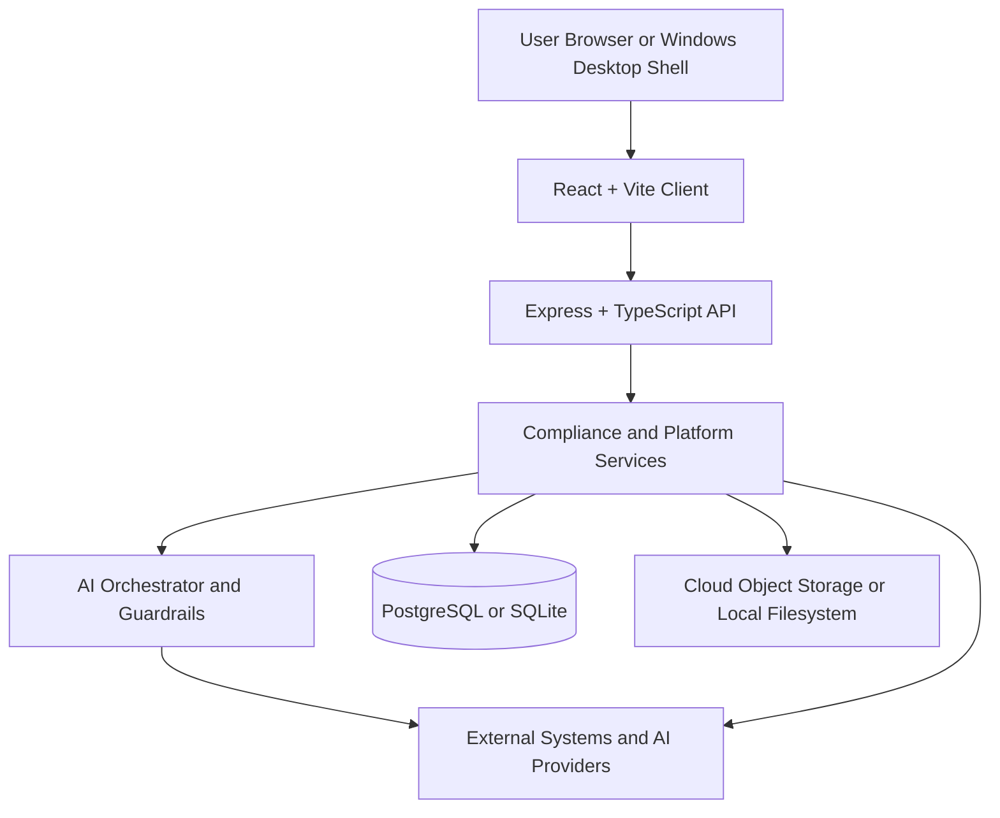

# CyberDocGen

Production-focused compliance documentation platform for two deployment targets:

- Cloud SaaS: multi-tenant web app with PostgreSQL, cloud storage, and enterprise authentication
- Windows desktop: local-first app with SQLite, local file storage, and desktop-safe secret handling

CyberDocGen helps teams generate, review, score, and manage compliance documentation and evidence for ISO 27001:2022, SOC 2, FedRAMP, and NIST 800-53 Rev. 5. The platform routes AI workloads across `gpt-5.4`, `claude-sonnet-4-6`, and `gemini-3.1-pro-preview`, exposes an MCP server for agent workflows, and includes release-validation tooling for both cloud and Windows delivery paths.

[](LICENSE)
[](https://nodejs.org/)
[](https://www.typescriptlang.org/)
[](https://react.dev/)
[](https://vitejs.dev/)
[](docs/WINDOWS_DESKTOP_GUIDE.md)

## What It Does

- Generates and analyzes compliance documentation with multi-model AI orchestration and guardrails
- Runs cloud-integrated evidence collection across Google Drive, OneDrive, SharePoint, Jira, Notion, and web snapshots
- Supports enterprise auth, MFA, RBAC, audit logging, and multi-tenant organization boundaries in cloud mode
- Supports Windows local mode with SQLite, local file storage, Windows Credential Manager, and auth bypass for offline desktop use
- Exposes MCP tools for agent-driven document generation, analysis, risk scoring, and compliance workflows
- Ships with validation scripts for TypeScript, linting, tests, cloud readiness, Windows packaging, and release evidence

## Deployment Modes

| Mode | Primary Use | Auth | Data Layer | Storage | Default Runtime |
| --- | --- | --- | --- | --- | --- |
| Cloud | Multi-tenant SaaS | Replit OIDC + enterprise auth flows | PostgreSQL via Neon | Cloud object storage | `npm run dev` / `npm start` |
| Local | Windows desktop app | Local bypass provider | SQLite | Local filesystem | Electron-packaged desktop build |

Source of truth for mode behavior lives in [server/config/runtime.ts](server/config/runtime.ts).

## Architecture At A Glance



More diagrams are in [docs/DIAGRAMS.md](docs/DIAGRAMS.md).

## Quick Start

```bash
git clone https://github.com/kherrera6219/cyberdocgen.git
cd cyberdocgen
npm install
cp .env.example .env
```

Minimum local-development environment:

```dotenv
# Leave blank to use local SQLite during local development
DATABASE_URL=

SESSION_SECRET=replace-with-a-random-32-char-secret
ENCRYPTION_KEY=replace-with-a-32-byte-hex-key
DATA_INTEGRITY_SECRET=replace-with-a-random-secret

# Configure at least one AI provider for generation features
OPENAI_API_KEY=
ANTHROPIC_API_KEY=
GOOGLE_GENERATIVE_AI_KEY=
# Optional legacy alias
GEMINI_API_KEY=
```

Then run:

```bash
npm run db:push
npm run dev
```

Default local endpoints:

- App: `http://localhost:5000`
- Health: `http://localhost:5000/health`
- Swagger UI: `http://localhost:5000/api-docs` only when `ENABLE_SWAGGER=true`

For the full setup path, use [docs/QUICK_START.md](docs/QUICK_START.md) and [docs/ENVIRONMENT_SETUP.md](docs/ENVIRONMENT_SETUP.md).

## Validation Commands

Core quality gates:

```bash
npm run check
npm run lint
npm run test:run
npm run build
```

Deployment-specific validation:

```bash
npm run cloud:validate
npm run cloud:validate:strict
npm run windows:validate
npm run windows:validate:store
npm run windows:evidence:validate
```

Desktop packaging:

```bash
npm run build:win
npm run build:store
```

## Repository Layout

- [client](client): React UI, route-level pages, design system, local-mode UX
- [server](server): Express routes, auth providers, services, MCP server, runtime configuration
- [shared](shared): shared schema and cross-runtime types
- [electron](electron): desktop shell entrypoints and preload code
- [tests](tests): Vitest unit/integration suites and Playwright coverage
- [scripts](scripts): validation, packaging, evidence, and maintenance automation
- [docs](docs): architecture, deployment, security, testing, operational runbooks, and diagrams

## Documentation Map

Start here:

- [docs/QUICK_START.md](docs/QUICK_START.md): fastest path to a working local environment
- [docs/ENVIRONMENT_SETUP.md](docs/ENVIRONMENT_SETUP.md): environment variables, providers, and local/cloud configuration
- [docs/DEPLOYMENT.md](docs/DEPLOYMENT.md): cloud and Windows desktop deployment paths

Architecture and APIs:

- [docs/ARCHITECTURE.md](docs/ARCHITECTURE.md): system architecture and major subsystems
- [docs/DIAGRAMS.md](docs/DIAGRAMS.md): Mermaid diagrams for system, deployment, AI, and evidence flows
- [docs/API_ENDPOINTS.md](docs/API_ENDPOINTS.md): route inventory and auth expectations
- [docs/OPENAPI.md](docs/OPENAPI.md): Swagger/OpenAPI generation behavior

Security, operations, and testing:

- [SECURITY.md](SECURITY.md): GitHub-facing vulnerability reporting policy
- [docs/SECURITY.md](docs/SECURITY.md): application security architecture
- [docs/SECURITY_PRODUCTION_REVIEW.md](docs/SECURITY_PRODUCTION_REVIEW.md): production-readiness security review
- [docs/TESTING.md](docs/TESTING.md): test strategy and command map
- [docs/WINDOWS_DESKTOP_GUIDE.md](docs/WINDOWS_DESKTOP_GUIDE.md): desktop install and local-mode behavior

Project contribution and support:

- [CONTRIBUTING.md](CONTRIBUTING.md): contribution workflow and standards
- [SUPPORT.md](SUPPORT.md): where to ask for help and how to file issues
- [CHANGELOG.md](CHANGELOG.md): release history
- [LICENSE](LICENSE): PolyForm Noncommercial license

## Security and Support

- Security issues: use [SECURITY.md](SECURITY.md). Do not open public vulnerability reports.
- General help and bug reports: use [SUPPORT.md](SUPPORT.md).
- Design and implementation expectations: use [CONTRIBUTING.md](CONTRIBUTING.md).

## License

CyberDocGen is licensed under the [PolyForm Noncommercial License 1.0.0](LICENSE).
