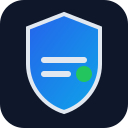
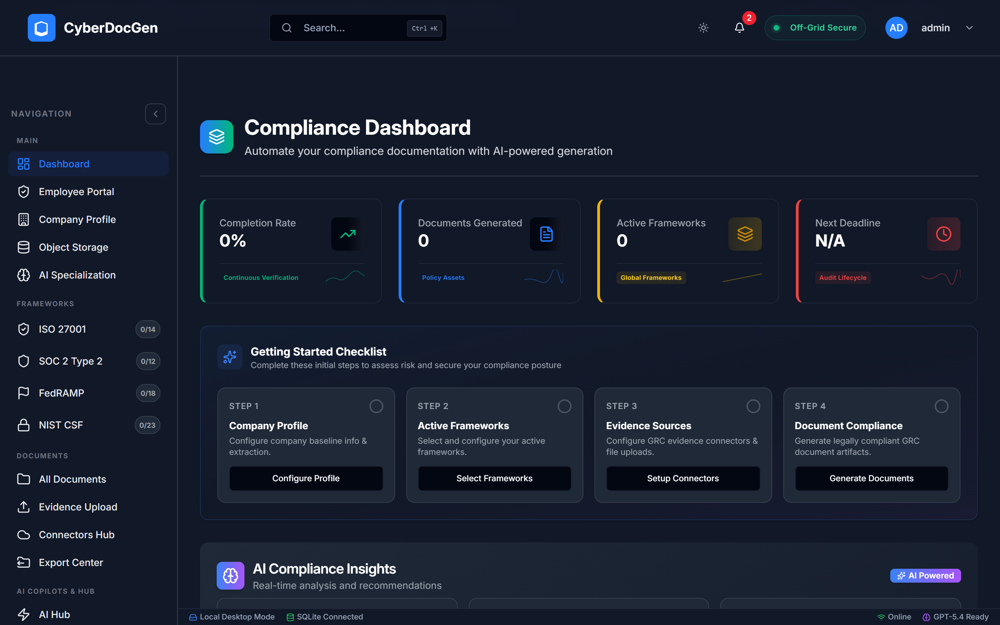
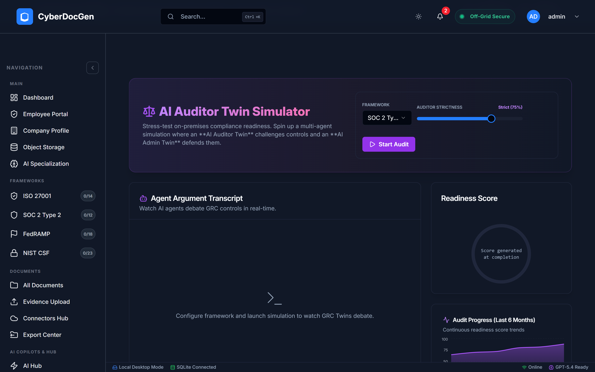
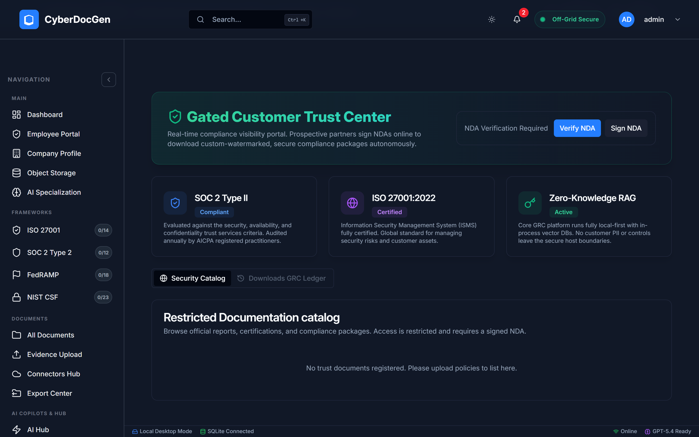
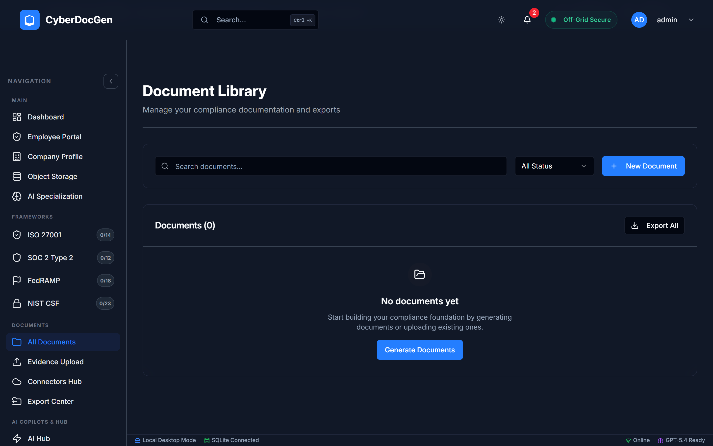
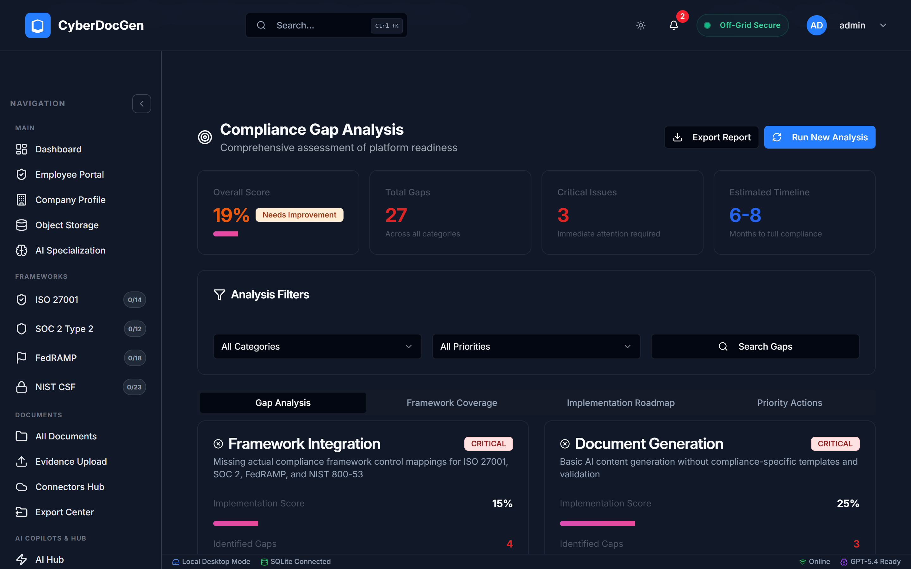
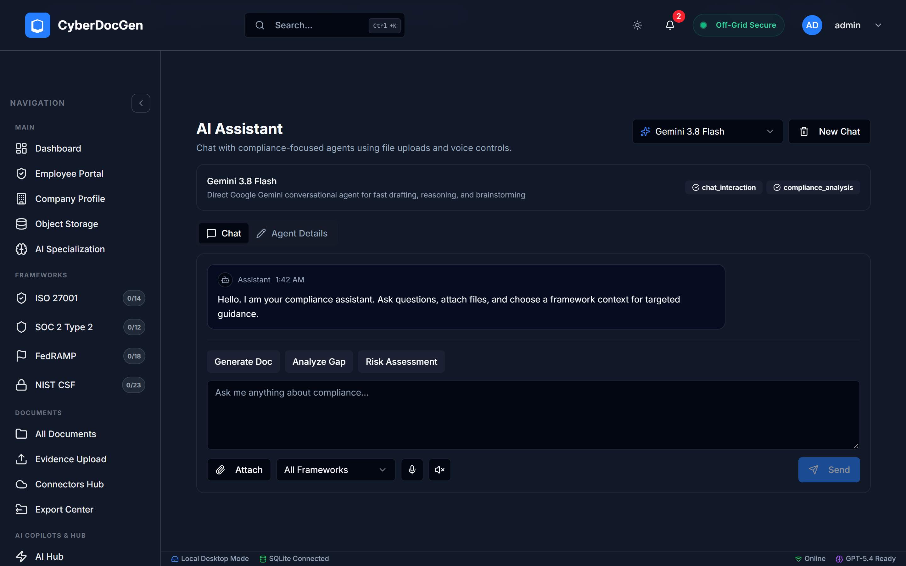
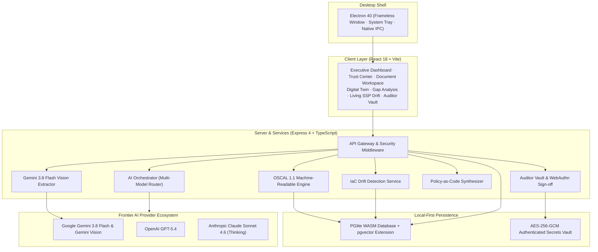

<div align="center">



# CyberDocGen

### Next-Gen AI-Powered GRC & Compliance Operating System

**Local-First · On-Premises Ready · Multi-Framework · Enterprise-Grade**

[](https://github.com/kherrera6219/cyberdocgen/actions/workflows/ci.yml)
[](#validation--quality-gates)
[](https://nodejs.org/)
[](https://www.typescriptlang.org/)
[](#ai--llm-integration)
[](#1-oscal-11-machine-readable-export-engine)
[](LICENSE)
[](docs/WINDOWS_DESKTOP_GUIDE.md)

---

*The local-first compliance operating system that runs entirely on your hardware — no cloud dependency, no data egress, no vendor lock-in.*

</div>

---

## 📸 Visual Product Showcase

<div align="center">

### Executive Compliance Command Center
*Real-time compliance maturity dials, multi-framework status tracking, active risk posture, and audit velocity metrics.*


<br/><br/>

### AI Auditor "Digital Twin" Simulator
*Multi-agent adversarial debate engine pitting a strict AI Auditor against an AI Admin defending policies with real-time gap telemetry.*


<br/><br/>

### Gated Customer Trust Center
*Public attested security portal featuring cryptographically sealed NDA enforcement and dynamic watermarked document downloads.*


<br/><br/>

### Real-Time Document Workspace & Multi-Framework Authoring
*Audit-ready policy authoring, automated version control, and multi-model AI synthesis across SOC 2, ISO 27001, FedRAMP, and NIST.*


<br/><br/>

### Dynamic Gap Analysis & Control Coverage Matrix
*Automated control scoring, evidence-to-requirement tracing, and immediate remediation roadmaps.*


<br/><br/>

### Frontier Multi-Model AI Orchestrator
*Intelligent model routing across Google Gemini 3.8 Flash, OpenAI GPT-5.4, and Anthropic Claude Sonnet 4.6.*


</div>

---

## Table of Contents

1. [What is CyberDocGen?](#what-is-cyberdocgen)
2. [Next-Generation Platform Capabilities](#next-generation-platform-capabilities)
3. [Key Features](#key-features)
4. [Architecture](#architecture)
5. [Technology Stack](#technology-stack)
6. [Deployment Modes](#deployment-modes)
7. [Quick Start](#quick-start)
8. [AI & LLM Integration](#ai--llm-integration)
9. [Compliance Frameworks](#compliance-frameworks)
10. [Database & Storage](#database--storage)
11. [Security Architecture](#security-architecture)
12. [Validation & Quality Gates](#validation--quality-gates)
13. [Production Deployment](#production-deployment)
14. [Documentation Map](#documentation-map)
15. [Contributing & License](#contributing--license)

---

## What is CyberDocGen?

CyberDocGen is an **enterprise-grade Governance, Risk & Compliance (GRC) platform** that combines multi-model AI orchestration with comprehensive compliance tooling. Designed for security teams, compliance officers, and auditors, it generates, scores, reviews, and manages the full lifecycle of compliance documentation — entirely on-premises.

Unlike SaaS-based GRC tools that transmit sensitive policies, architecture diagrams, and evidence to third-party cloud infrastructure, CyberDocGen operates as a **self-contained local application**. It ships as a native Windows desktop installer (`.exe`), can be deployed as a Docker container on a VM, and connects seamlessly to an embedded PGlite WASM engine or external PostgreSQL instance.

### Who is it for?

| Persona | Primary Use |
|---|---|
| **CISO / Security Executive** | Program-level compliance oversight, WebAuthn sign-offs, risk register, policy lifecycle |
| **Compliance Officer** | Living SSP drift management, OSCAL 1.1 exports, gap analysis, evidence mapping |
| **Auditor** | Standalone `.cyberdoc` vault review, immutable evidence provenance, deficiency logging |
| **DevSecOps / Platform Engineer** | Policy-as-Code (OPA/Rego) synthesis, Terraform compliance tests, CI/CD gating |
| **Enterprise IT** | Active Directory / LDAP synchronization, local admin settings, offline air-gapped readiness |

---

## 🚀 Next-Generation Platform Capabilities

### 1. OSCAL 1.1 Machine-Readable Export Engine
* **Standardized Government & Defense Compliance**: Automatically generates official **NIST SP 800-53 Rev 5** and **FedRAMP Moderate/High** compliant System Security Plans (SSPs) in native **OSCAL 1.1 JSON and YAML**.
* **Validated Schemas**: Full structural compliance covering `import-profile`, `system-characteristics`, `system-implementation`, and `control-implementation`.
* **API Endpoints**: `POST /api/oscal/ssp/generate`, `POST /api/oscal/validate`.

### 2. Living SSP & IaC Drift Detection Engine
* **Eliminate Documentation Rot**: Parses Terraform source code (`.tf`) and Terraform state files (`.tfstate`) to extract live cloud configurations (S3 buckets, RDS databases, Security Groups, IAM policies).
* **Automated Discrepancy Analysis**: Detects when active infrastructure diverges from documented compliance claims (e.g. unencrypted S3 buckets violating NIST SC-13 or open ingress violating NIST SC-7).
* **One-Click Documentation Diffs**: Computes real-time compliance scores and outputs AI-powered documentation amendment diffs.
* **API Endpoints**: `POST /api/drift/analyze`.

### 3. Architecture Diagram-to-Graph & Boundary Extractor
* **Multimodal Vision Intelligence**: Powered by **Gemini 3.8 Flash Vision**, parses uploaded architecture diagrams (PNG, JPEG, WebP, SVG).
* **Automated Topology Mapping**: Extracts subnets (Public DMZ, Private App Tier, Isolated DB Tier), ingress/egress points, and cross-boundary encrypted data flows.
* **NIST Section 9 & 10 Narratives**: Automatically composes NIST SP 800-18 / FedRAMP Section 9 (System Architecture) and Section 10 (Authorization Boundary) text, with executable Mermaid flowcharts.
* **API Endpoints**: `POST /api/diagrams/analyze`.

### 4. Policy-as-Code (PaC) Bi-Directional Synthesizer
* **From Legal Prose to CI/CD Enforcement**: Automatically translates natural-language cybersecurity policies into executable **Open Policy Agent (OPA) Rego** rules.
* **Terraform Tests**: Generates `terraform test` assert blocks to validate infrastructure code before apply.
* **Turnkey CI/CD**: Packages ready-to-run GitHub Actions workflows for automated PR compliance gating.
* **API Endpoints**: `POST /api/policy-as-code/synthesize`.

### 5. Interactive Auditor Vault & WebAuthn Cryptographic Sign-Offs
* **Hardware-Backed FIDO2 / Passkey Sign-Offs**: Computes canonical SHA-256 document content hashes and produces verifiable cryptographic signature manifests (ECDSA ES256 / RSA RS256) for CISO, CTO, and Legal approvals.
* **Self-Contained Auditor Package (`.cyberdoc`)**: Exports an encrypted, zero-dependency HTML bundle containing the complete document, interactive control matrix, clickable citations with SHA-256 evidence hashes, and an in-browser deficiency logging tool.
* **API Endpoints**: `POST /api/auditor-vault/export`, `POST /api/auditor-vault/sign`.

---

## Key Features

### 📋 Multi-Framework Documentation Engine
- Multi-model AI generation across **ISO 27001:2022**, **SOC 2 Type II**, **FedRAMP Moderate & High**, and **NIST SP 800-53 Rev. 5**.
- Framework-aligned policy templates with version control, diff comparison, and approval lifecycles.
- Document watermarking, PDF encryption (AES-256), and digital signatures.

### 👁️ Multimodal Evidence Vision Auditor
- **Gemini 3.8 Vision Evidence Inspection**: Inspect visual evidence files (screenshots of AWS console, firewall rules, server configs) using computer vision.
- **Automated Verification**: Generates audit verdicts, confidence ratings, and detailed auditor notes stored in the local evidence database.

### 🛡️ Gated Customer Trust Center Portal
- **Attested Security Portal**: Showcase real-time compliance maturity, SOC 2/ISO certifications, and policy catalogs to prospective buyers via `client/src/pages/trust-center.tsx`.
- **Cryptographically Sealed NDAs**: Legally-binding SHA-256 HMAC NDA signing workflow.
- **Watermarked & Locked Downloads**: Dynamic watermarking overlays (`RESTRICTED - FOR <BUYER> ONLY...`) and AES-256 password locks applied on the fly.

### 🤖 AI Auditor "Digital Twin" Simulator
- **Multi-Agent GRC Debates**: Run background simulations in `services/digitalTwinService.ts` where an **AI Auditor Twin** challenges organizational controls, and an **AI Admin Twin** defends them using active policy documents.
- **Readiness Scoring & Roadmaps**: Live transcripts, circular compliance dial scores, and downloadable mock-audit markdown reports.

### 🏢 Enterprise Identity & Active Directory Bindings
- **LDAP / Active Directory Integration**: Robust on-premises AD binding (LDAP URL, Bind DN, search scopes) allowing corporate network teams to authenticate with domain credentials.
- **Identity Sync Matrix**: Multi-provider sync (Okta, Microsoft Entra ID, Rippling, Gusto) via Directory APIs, executing access revocation reviews and automated user offboarding telemetry.

### 🔍 Local pgvector Semantic RAG
- **Spreadsheet Question Answering**: Ingest custom security questionnaire spreadsheets (CSV, XLSX) sent by prospective clients.
- **Local pgvector RAG**: Automatically answers questions by querying policy documents, active controls, and codebases, providing confidence scores and exact policy citations.

---

## Architecture

CyberDocGen follows a **local-first, service-oriented architecture** built on a TypeScript monorepo with end-to-end type safety:


```mermaid
flowchart TD
    subgraph Client ["Client Layer (React 18 + Vite)"]
        UI["Executive Dashboard · Trust Center · Document Workspace<br/>Digital Twin · Gap Analysis · Living SSP Drift · Auditor Vault"]
    end

    subgraph DesktopShell ["Desktop Shell"]
        Electron["Electron 40 (Frameless Window · System Tray · Native IPC)"]
    end

    subgraph Backend ["Server & Services (Express 4 + TypeScript)"]
        Router["API Gateway & Security Middleware"]
        Orchestrator["AI Orchestrator (Multi-Model Router)"]
        OscalEngine["OSCAL 1.1 Machine-Readable Engine"]
        DriftEngine["IaC Drift Detection Service"]
        VisionEngine["Gemini 3.8 Flash Vision Extractor"]
        PacEngine["Policy-as-Code Synthesizer"]
        VaultEngine["Auditor Vault & WebAuthn Sign-off"]
    end

    subgraph Persistence ["Local-First Persistence"]
        PGlite["PGlite WASM Database + pgvector Extension"]
        Vault["AES-256-GCM Authenticated Secrets Vault"]
    end

    subgraph FrontierAI ["Frontier AI Provider Ecosystem"]
        Gemini["Google Gemini 3.8 Flash & Gemini Vision"]
        OpenAI["OpenAI GPT-5.4"]
        Claude["Anthropic Claude Sonnet 4.6 (Thinking)"]
    end

    Electron --> UI
    UI --> Router
    Router --> Orchestrator
    Router --> OscalEngine
    Router --> DriftEngine
    Router --> VisionEngine
    Router --> PacEngine
    Router --> VaultEngine

    Orchestrator --> FrontierAI
    VisionEngine --> Gemini
    OscalEngine --> PGlite
    DriftEngine --> PGlite
    VaultEngine --> Vault
    Router --> PGlite
```

---

## Technology Stack

| Layer | Technology | Purpose |
|---|---|---|
| **Runtime** | Node.js 22 LTS | Server runtime |
| **Language** | TypeScript 5.9 | End-to-end strict type safety |
| **Frontend** | React 18.3 + Vite 6.4 | SPA with Lightning HMR |
| **UI Primitives** | Radix UI + Tailwind CSS 3 | Accessible, responsive enterprise design system |
| **API Server** | Express 4 | REST API + defense-in-depth middleware |
| **ORM** | Drizzle ORM 0.45 | Type-safe SQL schema & query generation |
| **Database (Local)** | PGlite WASM + pgvector | Embedded in-process PostgreSQL engine |
| **Database (Remote)** | PostgreSQL 15+ | Enterprise VM / cloud deployments |
| **Desktop Packaging** | Electron 40 + electron-builder | Native Windows desktop installer (`.exe`) |
| **AI: Google** | `@google/genai` | Gemini 3.8 Flash & Gemini Vision |
| **AI: OpenAI** | `openai` SDK | GPT-5.4 & GPT-4o |
| **AI: Anthropic** | `@anthropic-ai/sdk` | Claude Sonnet 4.6 (Extended Thinking) |
| **Machine-Readable Standard** | OSCAL 1.1 | NIST / FedRAMP JSON & YAML SSP export |
| **Policy Enforcement** | OPA / Rego | Policy-as-Code synthesis for CI/CD |
| **Cryptography** | AES-256-GCM + PBKDF2 + WebAuthn | Field-level encryption & hardware-backed sign-offs |
| **Testing** | Vitest 4.1 + Playwright | 100% pass rate across 180 test files |

---

## Deployment Modes

CyberDocGen supports three deployment topologies from the exact same codebase:

| Mode | Infrastructure | Auth | Database | Best For |
|---|---|---|---|---|
| **Desktop (Default)** | Windows 10/11 PC | Local admin bypass | PGlite WASM (embedded) | Single-user, fully air-gapped workstations |
| **On-Premises VM** | Linux/Windows Server | LDAP / Active Directory | PostgreSQL | Enterprise internal network deployment |
| **Cloud** | Docker / Kubernetes | Enterprise SSO / OIDC | PostgreSQL | Scalable multi-tenant cloud deployment |

---

## Quick Start

### Prerequisites
- Node.js ≥ 20.0.0 (Node 22 LTS recommended)
- npm ≥ 10.0.0
- Git

### 1. Clone & Install
```bash
git clone https://github.com/kherrera6219/cyberdocgen.git
cd cyberdocgen
npm install
```

### 2. Configure Environment
```bash
cp .env.example .env
```

Configure your `.env` with security keys and your choice of AI provider:
```dotenv
# Leave blank to use embedded PGlite WASM (recommended for local desktop)
DATABASE_URL=

# Cryptographic secrets — generate with: openssl rand -hex 32
SESSION_SECRET=replace-with-a-random-32-char-secret
ENCRYPTION_KEY=replace-with-a-64-char-hex-key-0000000000000000
DATA_INTEGRITY_SECRET=replace-with-a-random-secret

# AI Providers (configure at least one)
GOOGLE_GENERATIVE_AI_KEY=AIza...
OPENAI_API_KEY=sk-...
ANTHROPIC_API_KEY=sk-ant-...
```

### 3. Build & Run
```bash
# Push database schema
npm run db:push

# Start local server
npm run dev

# Or run complete desktop production build
npm run build
npm run start
```

Access the application:
* Web Application: `http://localhost:5000` (or configured port)
* Health Check: `http://localhost:5000/health`
* Swagger API Documentation: `http://localhost:5000/api-docs` (when `ENABLE_SWAGGER=true`)

---

## AI & LLM Integration

### Multi-Provider Orchestration Matrix

| Provider | Model | Primary Capabilities |
|---|---|---|
| **Google** | **Gemini 3.8 Flash** | High-velocity policy generation, RAG summarization, low-latency MCP tools |
| **Google** | **Gemini Vision** | Multimodal screenshot verification, architecture diagram-to-graph extraction |
| **OpenAI** | **GPT-5.4** | Deep legal and regulatory synthesis, complex gap analysis |
| **Anthropic** | **Claude Sonnet 4.6** | Multi-step control mapping, extended architectural reasoning |

---

## Validation & Quality Gates

CyberDocGen enforces a rigorous quality and security pipeline:

| Gate | Tool | Status | Metrics |
|---|---|:---:|---|
| **TypeScript Type Safety** | `tsc` strict | ✅ Passing | **0 errors** across all client & server modules |
| **Linting & Code Style** | ESLint 9 | ✅ Passing | **0 errors, 0 warnings** |
| **Unit & Integration Tests** | Vitest 4.1 | ✅ Passing | **180 / 180 test files passed (100%)** |
| **Total Test Suite Volume** | Vitest | ✅ Passing | **1,633 / 1,633 tests passed (0 skipped, 0 failed)** |
| **Build & Packaging** | Vite + esbuild | ✅ Passing | Clean client bundle and Electron distribution |

### Local Verification Commands
```bash
npm run check          # TypeScript type check (0 errors)
npm run lint           # ESLint verification
npm run test:run       # Full test execution (1,633 tests)
npm run build          # Client and server production build
npm run build:desktop  # Complete desktop distribution build
```

---

## Documentation Map

### Architecture & Standards
* [docs/ARCHITECTURE.md](docs/ARCHITECTURE.md) — Comprehensive technical architecture
* [docs/MODEL_CARDS.md](docs/MODEL_CARDS.md) — AI model specifications and governance
* [docs/LOCAL_FIRST_SECURITY_ARCHITECTURE.md](docs/LOCAL_FIRST_SECURITY_ARCHITECTURE.md) — Cryptographic and storage protections
* [docs/LOCAL_FIRST_ERROR_HANDLING.md](docs/LOCAL_FIRST_ERROR_HANDLING.md) — Local error handling standards

### Deployment & Operations
* [docs/WINDOWS_DESKTOP_GUIDE.md](docs/WINDOWS_DESKTOP_GUIDE.md) — Windows desktop installation guide
* [docs/ENVIRONMENT_SETUP.md](docs/ENVIRONMENT_SETUP.md) — Environment configuration reference
* [docs/TESTING.md](docs/TESTING.md) — Testing strategy and QA framework

---

## Contributing & License

We welcome contributions from the cybersecurity, GRC, and developer communities. Please review [CONTRIBUTING.md](CONTRIBUTING.md) and [CODE_OF_CONDUCT.md](CODE_OF_CONDUCT.md) before submitting Pull Requests.

CyberDocGen is licensed under the **[PolyForm Noncommercial License 1.0.0](LICENSE)**.

<div align="center">

Built with ❤️ for the global cybersecurity and compliance community.

</div>
