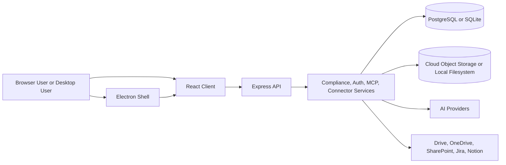
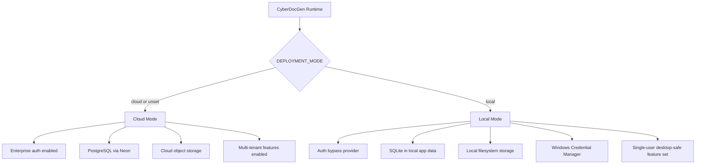
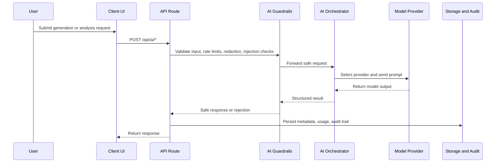
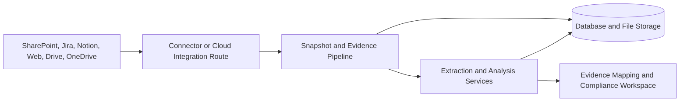

# CyberDocGen Diagrams

This page consolidates the high-level diagrams that are normally expected in a production repository: system context, deployment topology, AI request flow, and evidence ingestion flow.

For the narrative architecture document, see [ARCHITECTURE.md](ARCHITECTURE.md).

## 1. System Context

## 2. Deployment Modes

Source of truth: [server/config/runtime.ts](../server/config/runtime.ts).

## 3. AI Request Flow

## 4. Evidence And Connector Flow

## 5. Documentation Cross-Reference

- Architecture narrative: [ARCHITECTURE.md](ARCHITECTURE.md)
- API surface: [API_ENDPOINTS.md](API_ENDPOINTS.md)
- Deployment operations: [DEPLOYMENT.md](DEPLOYMENT.md)
- Security posture: [SECURITY.md](SECURITY.md) and [SECURITY_PRODUCTION_REVIEW.md](SECURITY_PRODUCTION_REVIEW.md)
