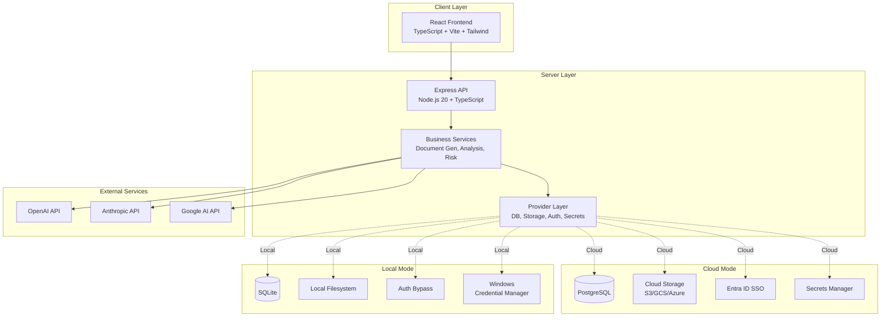
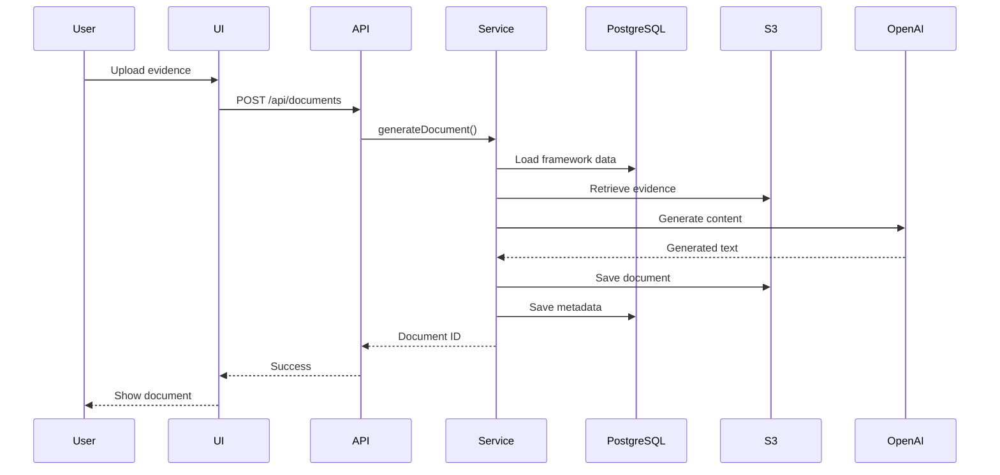
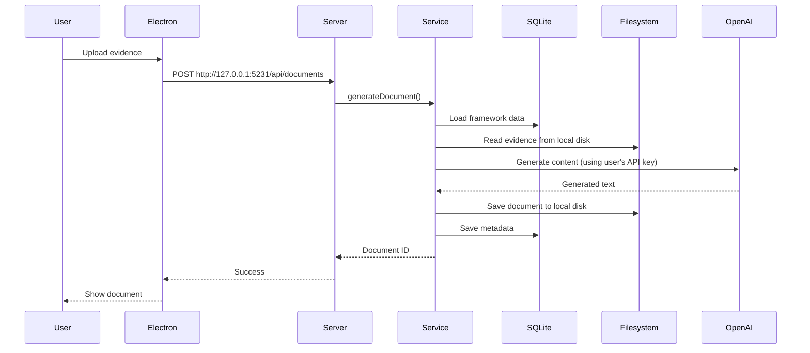
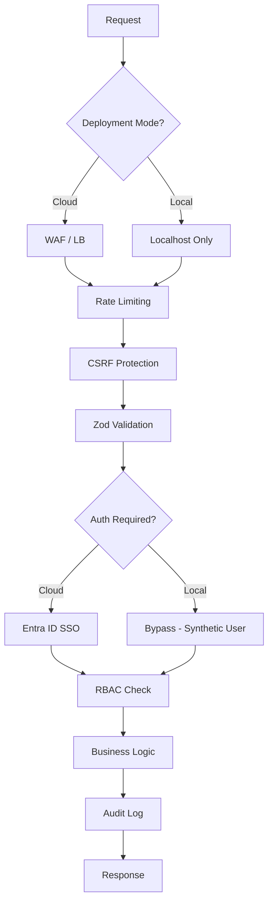

# CyberDocGen Architecture

**Last Updated:** January 20, 2026  
**Status:** Living Document  
**Owner:** Architecture Team

## Overview

CyberDocGen is an **enterprise compliance management platform** that automates compliance documentation across multiple frameworks (ISO 27001, SOC 2, FedRAMP, NIST 800-53) using AI-powered analysis and generation.

**Key Differentiator:** Dual-deployment architecture supporting both cloud SaaS and Windows 11 desktop modes from a single codebase.

## System Diagram



## Technology Stack

### Frontend
- **Framework:** React 18 + TypeScript 5.9
- **Build Tool:** Vite
- **Styling:** Tailwind CSS + Radix UI components
- **State Management:** React Query (TanStack Query)
- **Forms:** React Hook Form + Zod validation
- **Routing:** React Router

### Backend
- **Runtime:** Node.js 20
- **Framework:** Express.js
- **Language:** TypeScript 5.9 (strict mode)
- **ORM:** Drizzle ORM
- **Validation:** Zod schemas
- **Authentication:** Passport.js (cloud) / Bypass (local)

### Database
- **Cloud:** PostgreSQL 14+ (managed: AWS RDS / Azure Database / GCP Cloud SQL)
- **Local:** SQLite 3 (better-sqlite3)
- **Migrations:** Drizzle Kit

### Storage
- **Cloud:** S3 / GCS / Azure Blob Storage
- **Local:** Windows filesystem (`%LOCALAPPDATA%\CyberDocGen\files`)

### Desktop (Local Mode Only)
- **Framework:** Electron
- **Packaging:** electron-builder (NSIS installer)
- **Security:** keytar (Windows Credential Manager access)

## Architecture Principles

### 1. Provider Pattern

**All environment-specific behavior is abstracted behind provider interfaces.**

```typescript
// Feature code never checks deployment mode directly
const providers = await getProviders();
await providers.storage.save(file, path); // Works in both modes
```

**Benefits:**
- ✅ Environment concerns isolated from business logic
- ✅ Easy to test (mock providers)
- ✅ Future modes (e.g., Azure on-prem) require only new providers

### 2. Single Source of Truth for Mode

**Only `server/config/runtime.ts` reads `DEPLOYMENT_MODE`.**

```typescript
// ❌ DON'T DO THIS
if (process.env.DEPLOYMENT_MODE === 'local') { ... }

// ✅ DO THIS
import { isLocalMode } from '@/server/config/runtime';
if (isLocalMode()) { ... }
```

### 3. Security by Default

**Local mode is secure despite no authentication:**
- Bind to `127.0.0.1` only (no LAN exposure)
- API keys in OS-level secure storage (Windows Credential Manager)
- All validation, CSRF protection, and input sanitization remain active

**Cloud mode maintains existing security:**
- SSO/OIDC with Entra ID
- Multi-tenant data isolation
- MFA, audit logging, RBAC

### 4. Feature Flags Drive UI

**UI features auto-enable/disable based on mode:**

```typescript
const config = getRuntimeConfig();

// Org management only in cloud mode
{config.features.organizationManagement && <OrgSettings />}

// LLM key config only in local mode
{isLocalMode() && <LLMKeysSettings />}
```

## Core Components

### Business Services Layer

Located in `server/services/`:

- **`aiService.ts`** - LLM orchestration (OpenAI, Anthropic, Google AI)
- **`documentGenerationService.ts`** - Compliance document generation
- **`complianceAnalysisService.ts`** - Gap analysis, risk scoring
- **`frameworkService.ts`** - ISO 27001, SOC 2, FedRAMP logic
- **`auditTrailService.ts`** - Activity logging
- **`databaseHealthService.ts`** - Monitoring and metrics

**Design:** Services are deployment-mode agnostic. They consume providers, not implementations.

### Provider Layer

Located in `server/providers/`:

**Interfaces** (`interfaces.ts`):
- `IDbProvider` - Database operations
- `IStorageProvider` - File storage
- `ISecretsProvider` - Sensitive data (API keys)
- `IAuthProvider` - Authentication

**Implementations:**
- `db/postgres.ts` - Cloud database
- `db/sqlite.ts` - Local database
- `storage/cloud.ts` - S3/GCS/Azure
- `storage/localFs.ts` - Windows filesystem
- `auth/entraId.ts` - Cloud SSO
- `auth/localBypass.ts` - Local no-auth
- `secrets/environment.ts` - Cloud env vars
- `secrets/windowsCredMan.ts` - Local Credential Manager

**Factory** (`index.ts`):
- `createProviders()` - Returns correct providers based on mode
- `getProviders()` - Singleton accessor

### API Layer

Located in `server/routes/`:

Standard Express routers:
- `/api/documents` - Document management
- `/api/analysis` - Compliance analysis
- `/api/frameworks` - Framework metadata
- `/api/ai` - LLM interactions
- `/api/health` - Health checks
- `/api/setup` (local only) - First-run wizard

### Frontend Structure

Located in `client/src/`:

```
client/src/
├── pages/           # Route-level components
├── components/      # Reusable UI components
├── hooks/           # Custom React hooks
├── contexts/        # React context providers
├── api/             # API client functions
└── utils/           # Utilities
```

**Mode-aware routing:**
```typescript
// Router skips login in local mode
{isCloudMode() && <Route path="/login" element={<Login />} />}
<Route path="/" element={isCloudMode() ? <Redirect to="/dashboard" /> : <Dashboard />} />
```

## Data Flow

### Cloud Mode: Document Generation



### Local Mode: Document Generation



## Deployment Modes

### Cloud Deployment

**Target:** AWS / Azure / GCP

**Components:**
- Container: Docker image (Node.js + built frontend)
- Database: Managed PostgreSQL
- Storage: S3 / GCS / Azure Blob
- Secrets: AWS Secrets Manager / Azure Key Vault / GCP Secret Manager
- Load Balancer: ALB / Azure LB / GCP LB

**Infrastructure as Code:**
- Terraform templates in `terraform/`
- Kubernetes manifests in `k8s/`

### Local Deployment (Windows 11 Desktop)

**Target:** Windows 11 Professional (x64)

**Components:**
- Electron app (fullscreen)
- Embedded Node.js server (localhost only)
- SQLite database (`%LOCALAPPDATA%\CyberDocGen\cyberdocgen.db`)
- Local file storage (`%LOCALAPPDATA%\CyberDocGen\files\`)
- Windows Credential Manager (API keys)

**Distribution:**
- NSIS EXE installer
- Code-signed certificate
- Auto-update (optional)

## Security Architecture

### Threat Model

**Cloud Mode Threats:**
- Unauthorized access (mitigated by SSO/MFA)
- Data breaches (mitigated by encryption at rest/transit)
- Multi-tenant leakage (mitigated by org-scoped queries)
- DDoS (mitigated by rate limiting + WAF)

**Local Mode Threats:**
- LAN exposure (mitigated by localhost-only binding)
- API key theft (mitigated by Windows Credential Manager)
- Malicious document uploads (mitigated by validation)
- Electron vulnerabilities (mitigated by security hardening)

### Security Layers



### Secrets Management

**Cloud:**
- LLM API keys stored in Secrets Manager
- Database credentials from environment/secrets
- Encryption keys rotated regularly

**Local:**
- LLM API keys in Windows Credential Manager (user-provided)
- No database credentials needed (local SQLite file)
- Filesystem permissions protect data

## Performance Considerations

### Cloud Mode
- **Target:** < 200ms API response time (p95)
- **Scaling:** Horizontal (multiple Node.js instances)
- **Caching:** Redis for session data, query results
- **CDN:** CloudFront / Azure CDN for static assets

### Local Mode
- **Target:** < 100ms API response time (localhost)
- **Scaling:** N/A (single user)
- **Caching:** In-memory (no Redis required)
- **Startup:** < 5 seconds (cold start)

## Monitoring & Observability

### Cloud Mode
- **APM:** New Relic / Datadog / Application Insights
- **Logs:** CloudWatch / Azure Monitor / GCP Logging
- **Metrics:** Prometheus + Grafana
- **Alerts:** PagerDuty / Opsgenie

### Local Mode
- **Logs:** Local file rotation (`%LOCALAPPDATA%\CyberDocGen\logs\`)
- **Diagnostics:** Built-in diagnostics panel in UI
- **Crash Reports:** Optional anonymous telemetry (opt-in)

## Testing Strategy

### Unit Tests
- Provider implementations
- Business services (mocked providers)
- Utility functions

### Integration Tests
- API endpoints (both modes)
- Database migrations
- Provider integration (real DB/storage in test mode)

### E2E Tests
- Cloud: Playwright (web browser)
- Local: Playwright + Electron
- Critical user flows (document generation, analysis)

### Test Coverage Target
- Overall: 80%+
- Critical paths: 95%+

## Future Architecture Considerations

### Potential New Modes
- **Hybrid Cloud:** On-prem server + cloud LLMs
- **Air-gapped:** Local LLMs (Ollama/LM Studio integration)
- **Mobile:** React Native app (read-only)

### Extensibility
- Plugin system for custom frameworks
- Webhook support for external integrations
- GraphQL API (in addition to REST)

## References

- [Runtime Modes](./RUNTIME_MODES.md)
- [Provider Interfaces](../../server/providers/interfaces.ts)
- [Data Storage Strategy](./DATA_STORAGE.md)
- [Windows Desktop Implementation Plan](../../../brain/windows-desktop-implementation-plan.md)

## Changelog

- 2026-01-20 - Initial architecture documentation (Sprint 0)
