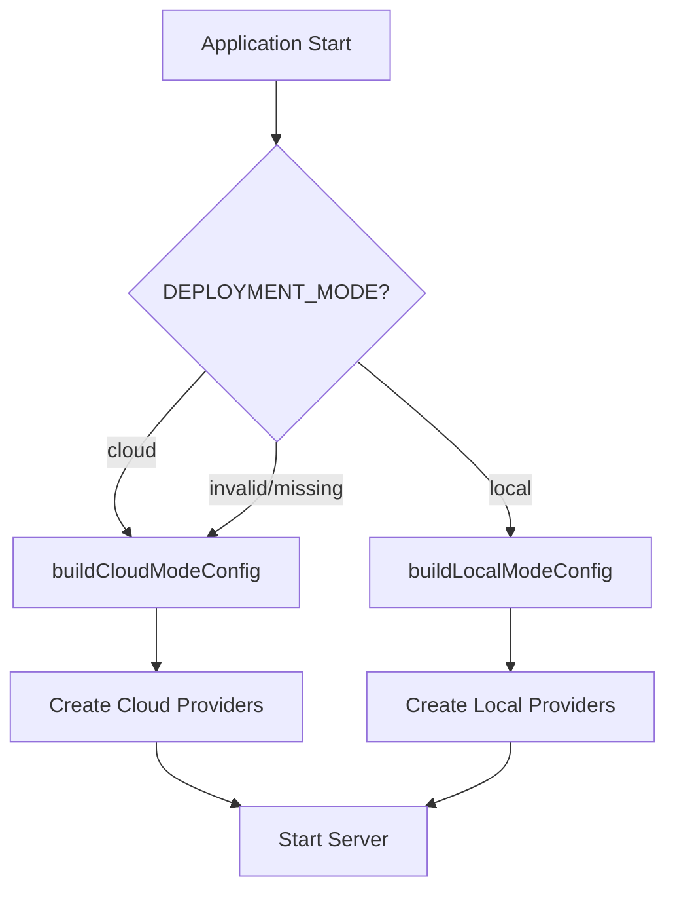

# Runtime Modes

**Last Updated:** January 20, 2026  
**Status:** Implemented (Sprint 0)  
**Owner:** Platform Team

## What

CyberDocGen supports two deployment modes controlled by a single environment variable `DEPLOYMENT_MODE`:

- **Cloud Mode**: Multi-tenant SaaS web application
- **Local Mode**: Windows 11 desktop application (single-user, no-login)

## Why

By supporting dual deployment modes, CyberDocGen can serve:

1. **Enterprise customers** who prefer cloud-hosted SaaS with SSO and multi-tenant management
2. **SMB/individual users** who prefer desktop software with local data storage and no subscription

This maximizes market reach while maintaining a single codebase.

## How

### Environment Variable

```bash
# Cloud mode (default)
DEPLOYMENT_MODE=cloud

# Local mode (Windows desktop app)
DEPLOYMENT_MODE=local
```

### Mode Comparison

| Aspect | Cloud Mode | Local Mode |
|--------|-----------|------------|
| **Deployment** | Web server (Node.js) | Electron desktop app |
| **Authentication** | Required (Entra ID SSO) | Disabled (auto-login) |
| **Database** | PostgreSQL (managed) | SQLite (local file) |
| **File Storage** | S3/GCS/Azure Blob | Local filesystem |
| **Secrets** | Environment variables / Secrets Manager | Windows Credential Manager |
| **Network** | Binds to `0.0.0.0` | Binds to `127.0.0.1` only |
| **Multi-tenancy** | Enabled (orgs + users) | Disabled (single workspace) |
| **SSO/MFA** | Enabled | Disabled |
| **LLM APIs** | Server-side keys | User-provided keys (stored securely) |

### Provider Architecture

All environment-specific behavior is abstracted behind provider interfaces:

```typescript
interface Providers {
  db: IDbProvider;          // PostgreSQL vs SQLite
  storage: IStorageProvider; // Cloud vs local filesystem
  secrets: ISecretsProvider; // Env vars vs Windows CredMan
  auth: IAuthProvider;       // Entra ID vs bypass
}
```

The provider factory (`server/providers/index.ts`) returns the correct implementations based on `DEPLOYMENT_MODE`.

### Configuration Flow



### Feature Flags

Features are automatically enabled/disabled based on mode:

```typescript
features: {
  organizationManagement: mode === 'cloud', // Only in cloud
  userManagement: mode === 'cloud',         // Only in cloud
  multiTenant: mode === 'cloud',            // Only in cloud
  sso: mode === 'cloud',                    // Only in cloud
  mfa: mode === 'cloud',                    // Only in cloud
}
```

## Code Examples

### Checking Mode

```typescript
import { isCloudMode, isLocalMode, getRuntimeConfig } from '@/server/config/runtime';

// Simple boolean checks
if (isLocalMode()) {
  // Local-specific logic
}

// Access full config
const config = getRuntimeConfig();
console.log(`Running in ${config.mode} mode`);
```

### Using Providers

```typescript
import { getProviders } from '@/server/providers';

const providers = await getProviders();

// Save a file (automatically uses correct storage)
await providers.storage.save(fileBuffer, 'documents/report.pdf');

// Store a secret (automatically uses correct secrets store)
await providers.secrets.set('openai-api-key', userProvidedKey);

// Authenticate (automatically bypasses in local mode)
const authContext = await providers.auth.authenticate(req);
```

## Security Considerations

### Local Mode Security

Even with no authentication, local mode includes security measures:

1. **Localhost binding**: Server only listens on `127.0.0.1` (not accessible from LAN)
2. **Secure secrets**: API keys stored in Windows Credential Manager (OS-level encryption)
3. **Input validation**: All Zod schemas and CSRF protection remain active
4. **Content Security Policy**: Electron CSP prevents XSS attacks

### Cloud Mode Security

Cloud mode retains all existing security:

1. **SSO/OIDC**: Entra ID authentication with PKCE
2. **Multi-tenant isolation**: Organization-scoped queries
3. **Audit logging**: All actions tracked
4. **MFA**: Optional two-factor authentication

## Implementation Status

### Sprint 0 (Complete)
- ✅ `DEPLOYMENT_MODE` environment variable
- ✅ `server/config/runtime.ts` module
- ✅ Provider interfaces defined
- ✅ Provider factory pattern

### Sprint 1 (Next)
- ⏳ SQLite database provider implementation
- ⏳ Local filesystem storage provider
- ⏳ Auth bypass middleware

### Sprint 2 (Future)
- ⏳ Electron integration
- ⏳ Desktop security hardening

### Sprint 3 (Future)
- ⏳ Windows Credential Manager integration
- ⏳ LLM key management UI

## Testing

### Mode Switching Tests

```typescript
describe('Runtime Modes', () => {
  beforeEach(() => {
    _resetRuntimeConfig();
  });

  it('defaults to cloud mode', () => {
    delete process.env.DEPLOYMENT_MODE;
    expect(getRuntimeConfig().mode).toBe('cloud');
  });

  it('uses local mode when set', () => {
    process.env.DEPLOYMENT_MODE = 'local';
    expect(isLocalMode()).toBe(true);
  });

  it('cloud mode binds to 0.0.0.0', () => {
    process.env.DEPLOYMENT_MODE = 'cloud';
    expect(getRuntimeConfig().server.host).toBe('0.0.0.0');
  });

  it('local mode binds to 127.0.0.1', () => {
    process.env.DEPLOYMENT_MODE = 'local';
    expect(getRuntimeConfig().server.host).toBe('127.0.0.1');
  });
});
```

## References

- [Architecture Overview](./ARCHITECTURE.md)
- [Provider Interfaces](../server/providers/interfaces.ts)
- [Windows Desktop Implementation Plan](../../brain/windows-desktop-implementation-plan.md)

## Changelog

- 2026-01-20 - Initial version (Sprint 0)
